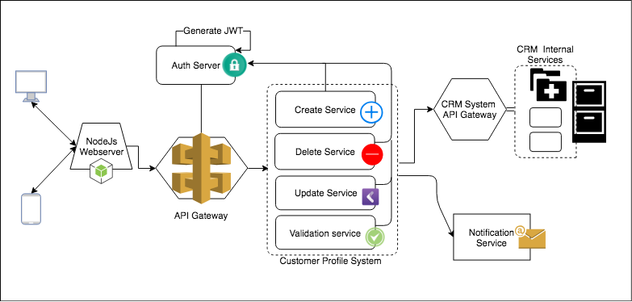
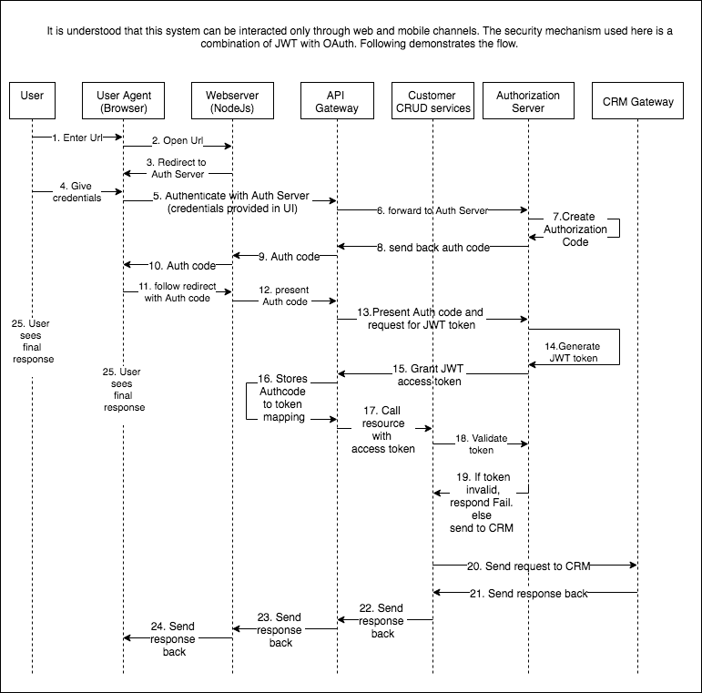

## Customer Profile Manager

###Assumptions
* The system can be interacted only through web and mobile channels, not through any third party applications.
* Auth server is in place for Authentication and authorization.
* A node webserver to enable server-side rendering for webapp.

### Project Architecture 

* User uses mobile or web UI to interact with the system to deal with customer data. 
Users can send three types of requests, `'Create Customer'` request, `'Delete Customer'` or a `'Update Customer'` request with customer details. 
* The data that is sent through these channels is received by backend NodeJs server. 
* This server sends the request to 'API Gateway' which verifies the access token with the 'Auth Server'.
    - If the token is invalid, 401 response is sent back to ask the user for authentication. 
    - If the token is valid, depending on the type of request, the corresponding service will be called.
    - The complete security mechanism is explained in the Security section below.  
* Customer Profile system has mainly 3 services for different request types, this is to enable horizontal scalability and high throughput.
    - There can other utility services (example: `Validation service` or `Notification Service`)    
* Once a service receives a request it verifies the access token received in header with Auth Server.
    - If the request is valid, it sends the data to CRM system by calling its APIs. The response from CRM is sent back to client.
    - If the request is invalid, 401 response is sent back so that the upstreams can request for authentication. 

### API Contract
API Contract is done in swagger. Find the file with name `'Api Contract Swagger.yaml'` in the project root folder. 

### Security
The below flow diagram explains the Authentication and Authorization mechanisms in detail. 

Flow:
